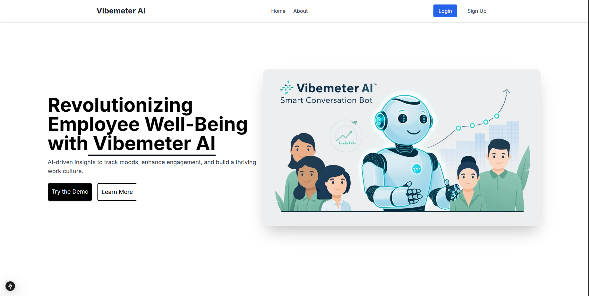

# Vibemeter AI Bot  

An AI-powered conversational bot designed to track employee well-being and engagement.




## 🛠️ Setup & Installation  

### 1(a). Clone the Repository
```sh
git clone https://github.com/Team99os25/frontend.git
cd frontend
```

### 1(b). First-Time Git Setup
```sh
# Initialize a new Git repository (if not already initialized)
git init

# Check the current branches
git branch -a

# Create and switch to a new branch (optional)
git checkout -b main

# Remove existing remote (if any)
git remote remove origin

# Add the correct remote origin
git remote add origin https://github.com/Team99os25/frontend.git

# Verify the remote URL
git remote -v

# Fetch the latest changes
git pull origin main
```

### 2(a). Git Pull & Push Guide

### 🔹 Pulling Latest Changes  
Before making any changes, always pull the latest updates from the repository to avoid conflicts.  
```sh
git pull origin main
```

### 🔹  Pushing Your Changes
```sh
git add .
git commit -m "Your commit message"
git push origin main
```


### 3(a). Run Development Server

```sh
npm install
npm run dev
```

### 3(b). Build & Run Production Server
```sh
npm run build
npm start
```


## 📂 Project Structure
```sh
📦 frontend 
 ┣ 📂 public                 # Static files (home.jpg, about.jpg, videos, etc.)  
 ┣ 📂 app                    # Next.js App Router  
 ┃ ┣ 📂 api                  # API Route Handlers (server-side logic)  
 ┃ ┣ 📜 layout.tsx           # Main layout (applies to all pages)  
 ┃ ┣ 📜 page.tsx             # Home Page  
 ┃ ┣ 📜 error.tsx            # Global error boundary  
 ┃ ┣ 📜 loading.tsx          # Loading spinner for suspense boundaries  
 ┃ ┗ ...  
 ┃ 📂 components             # Reusable UI components (Header, Footer, Hero, etc.)  
 ┃ 📂 lib                    # Utility functions and custom hooks  
 ┣ 📂 styles                 # Global styles and Tailwind configuration  
 ┣ 📂 middleware             # Middleware for authentication, logging, etc.  
 ┣ 📜 next.config.js         # Next.js Configuration  
 ┣ 📜 package.json           # Dependencies & Scripts  
 ┣ 📜 tailwind.config.js     # Tailwind CSS Configuration  
 ┣ 📜 .env                   # Environment variables  
 ┗ 📜 README.md              # Project Documentation  

```

## 📌 Next.js File Routing  

Next.js follows a file-based routing system under the `/app` directory:  

| File/Folder                  | Route (URL)          | Description                |
|------------------------------|----------------------|----------------------------|
| `app/page.tsx`               | `/`                  | Home Page                  |
| `app/about/page.tsx`         | `/about`             | About Page                 |
| `app/blog/[slug]/page.tsx`   | `/blog/:slug`        | Dynamic Blog Post Page     |
| `app/api/*`                  | `/api/*`             | API Endpoints              |


- Each file in `/app` automatically becomes a route.  
- API routes are inside `/app/api`, following a REST-like pattern.  

---

## 🔗 Making API Calls in Next.js  

### **1️⃣ Fetching Data from API Routes**  

API routes are defined under `/app/api`. You can fetch data using `fetch` or Axios:  

```tsx
useEffect(() => {
  fetch("/api/employees")
    .then(res => res.json())
    .then(data => console.log(data))
    .catch(error => console.error("Error:", error));
}, []);
```

### **2️⃣ Calling External APIs from Server-Side**  

If you need to call an external API inside an API route:  

```tsx
export async function GET() {
  const response = await fetch("https://api.example.com/data");
  const data = await response.json();
  
  return Response.json(data);
}
